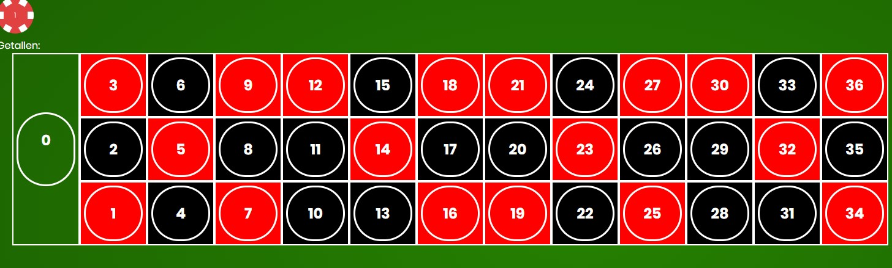
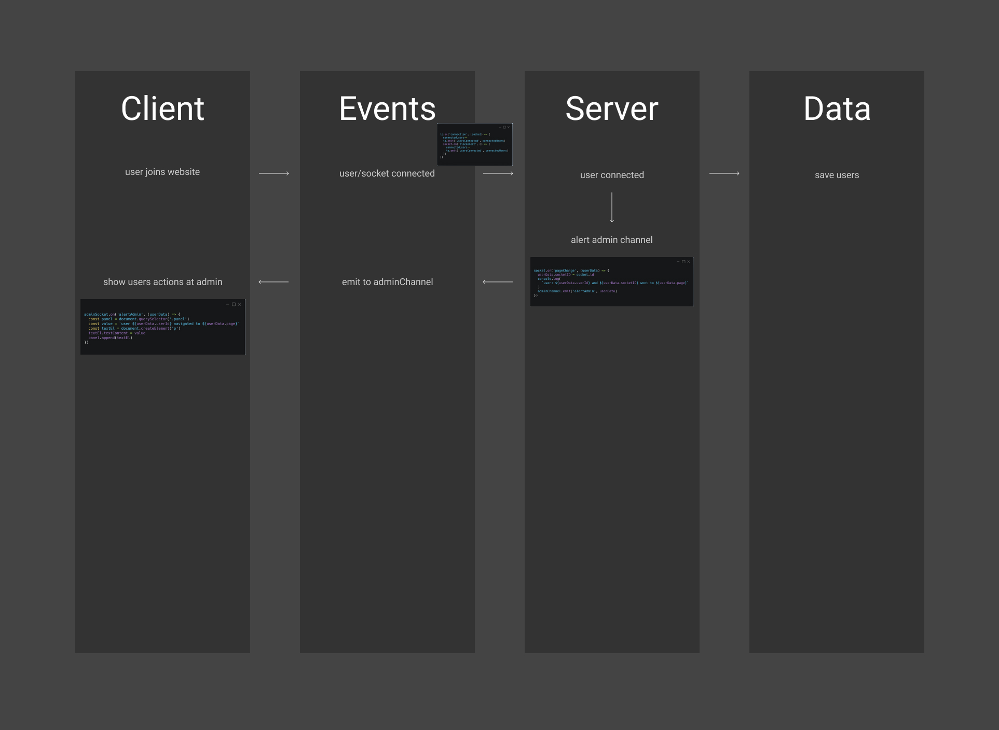

# Tracky.js

## App description
**Tracky.js**: A tracking tool/implementation to track user behaviour on your website.

[Live Demo]()

## Table of contents
- [Concepts](#concepts)
- [Wishlist](#wishlist)
- [Data lifecycle diagram](#data-lifecycle-diagram)
- [Used packages](#used-packages)
- [Install project](#install-project)
- [Sources](#sources)

## Concepts
### Tracking tool
A tracking tool to track your user behaviour on your website. You can present the data yourself in your own admin panel. 

### Multiplayer casino game
A roulette game where users can join a gameroom and play roulette together. With a chat to chat together.


### Google docs clone
A document editor to collab with your friends/colleagues. Similiar to google docs.

## What does Tracky.js give you?
Tracky.js gives you insights in your user's behaviour on your website. Based on these insights you can improve your website.


## Wishlist
MoSCoW

**M** - Must haves

- [x] Track amount live users

**S** - Should haves

- [ ] Simple implementation

**C** - Could haves


**W** - Would haves


## Data lifecycle diagram


## Used packages

## Install project
### 1. Clone this repo

Before we can get started, we'll need to clone this repo.
This can be done by typing the following line of code into your terminal:

```
git clone https://github.com/Jelmerovereem/real-time-web-2021.git
```

### 2. Install the packages

Next, we will have to install the used packages.

```
npm install
```

### 3. Start local dev environment

This can be done by typing the following line of code into your terminal:

```
npm run dev
```

### 4. Navigate to localhost

Almost done! We just need to navigate to the localhost in the browser.

```
http://localhost:9000/
```


## Sources