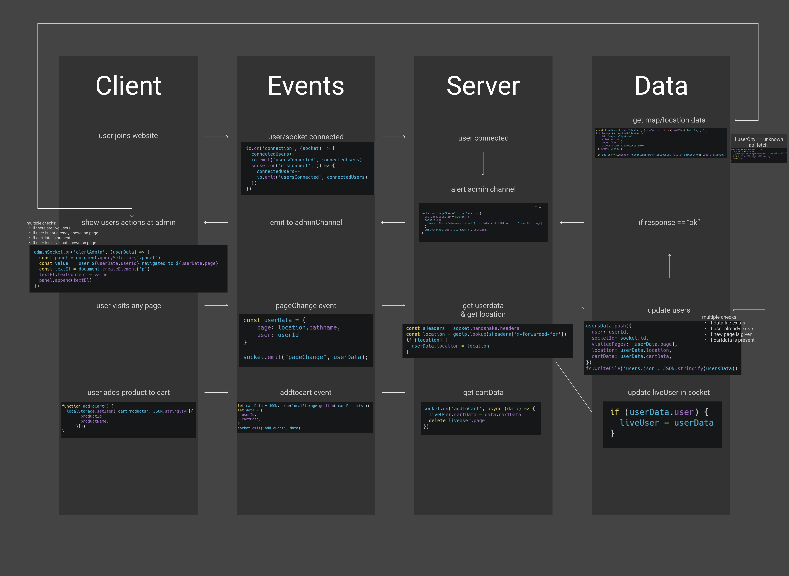

# Tracky.js

## App description
**Tracky.js**: A tracking tool/implementation to track user behaviour on your website.

[Live Demo](https://trackyjs.herokuapp.com/)

## Table of contents
- [Concepts](#concepts)
- [Wishlist](#wishlist)
- [Data lifecycle diagram](#data-lifecycle-diagram)
- [Used packages](#used-packages)
- [Install project](#install-project)
- [Sources](#sources)

## Concepts
### Tracking tool
A tracking tool to track your user behaviour on your website. You can present the data yourself in your own admin panel. 

### Multiplayer casino game
A roulette game where users can join a gameroom and play roulette together. With a chat to chat together.


### Google docs clone
A document editor to collab with your friends/colleagues. Similiar to google docs.

## What does Tracky.js give you?
Tracky.js gives you insights in your user's behaviour on your website. Based on these insights you can improve your website and generate more sales!
This library tracks your visitors visits, page visits, add to carts, location, and go so on.
With a interactive map you can view where your users come from.

**Features:**  
- Track (amount of) live visitor
- Track visited pages per visitor
- Show admin amount of live visitors
- Show admin the visited pages per visitor
- Visitors can view products
- Visitors can add product to cart
- Admin can see live carts
- Get location of visitor through IP address
- View location of visitors in admin page on a interactive map


## Wishlist
MoSCoW

**M** - Must haves

- [x] Track (amount of) live visitor
- [x] Track visited pages per visitor
- [x] Show admin amount of live visitors
- [x] Show admin the visited pages per visitor

**S** - Should haves
- [x] Visitors can view products
- [x] Visitors can add product to cart
- [x] Admin can see live carts
- [x] Get location of visitor through IP address
- [x] View location of visitors in admin page on a interactive map

**C** - Could haves
- [ ] Remove products from cart
- [ ] Admin can see total cart values
- [ ] View user data on the interactive map with a tooltip
- [ ] Visitors could visit checkout page and fill in details
- [ ] Admin could see what visitors are filling in at the checkout
- [ ] An implementation(as library) so other website owners can track their users aswell
- [ ] User data saved in firestores databases

**W** - Won't haves
- [ ] Documentation on how to use library/tool
- [ ] Different tracking segments splitted in different functions
- [ ] As addition a public domain for website owners to log onto a standard dashboard and see their analytics
- [ ] Maybe a tool to pair Google Analytics and Facebook Pixel to exchange data

## Data lifecycle diagram


### Events
* Visitor connects to website
  * alert admin that there is a new live user
* Visitor visits page
  * update users "database"
    * alert admin of new events
* Visitor adds product to cart
  * update users "database"
    * alert admin of new events

## Data
To get all the different Dutch cities I downloaded a _Netherlands Townships GeoJSON_ from [webuildinternet.com](https://www.webuildinternet.com/2015/07/09/geojson-data-of-the-netherlands/).

## API
### Live map
To show a interactive live map I use [leaflet.js](https://leafletjs.com/). It's very simple to set up a map:
```js
const liveMap = L.map("liveMap", {zoomControl: true}).setView([lat, lng], 5);
L.tileLayer(apiMapboxUrlRaster, {
	id: "mapbox/light-v9",
	tileSize: 512,
	zoomOffset: -1,
	accessToken: mapboxAccessToken
}).addTo(liveMap);
```
After this I lay the dutch cities over the map:
```js
import { netherlandsTownshipsGeoJSON } from "./utils/netherlandsTownships.js";

let geojson = L.geoJson(netherlandsTownshipsGeoJSON, {style: getGeoStyle}).addTo(liveMap);
```

### City names
The external API I use is the [OpenCage Geocoding API](https://opencagedata.com/). This API will help to show the visitors location on the map. Through IP address I try to get the visitors location, but not always the location comes with a city name. So with OpenCage I can search on coordinates to get a city name. I compare this city name with the _Netherlands Townships GeoJSON_.
```js
async function getCityname({lat, lng}) {
	const data = await fetch(`https://api.opencagedata.com/geocode/v1/json?q=${lat}+${lng}`).then(res => res.ok ? res.json() : "");
	const city = data.results[0].components.city;
	return city;
}
```


## Used packages
* body-parser
* dotenv
* ejs
* express
* express-session
* file-system
* geoip-lite
* node-fetch
* socket.io

### Dev
* localhost-logger
* nodemon

## Install project
### 1. Clone this repo

Before we can get started, we'll need to clone this repo.
This can be done by typing the following line of code into your terminal:

```
git clone https://github.com/Jelmerovereem/real-time-web-2021.git
```

### 2. Install the packages

Next, we will have to install the used packages.

```
npm install
```

### 3. Start local dev environment

This can be done by typing the following line of code into your terminal:

```
npm run dev
```

### 4. Navigate to localhost

Almost done! We just need to navigate to the localhost in the browser.

```
http://localhost:9000/
```


## Sources
* _Netherlands Townships GeoJSON_ from [webuildinternet.com](https://www.webuildinternet.com/2015/07/09/geojson-data-of-the-netherlands/)
* [Socket.io](https://www.socket.io/)
* [leaflet.js](https://leafletjs.com/)
* [OpenCage Geocoding API](https://opencagedata.com/)